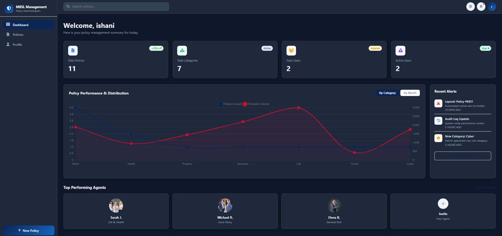
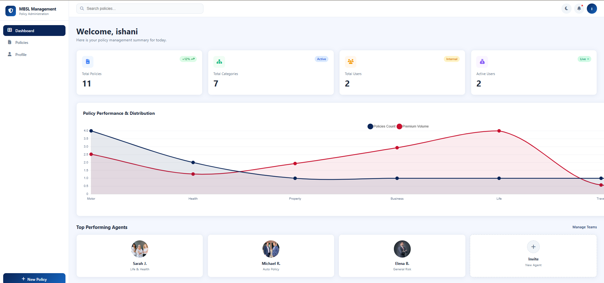
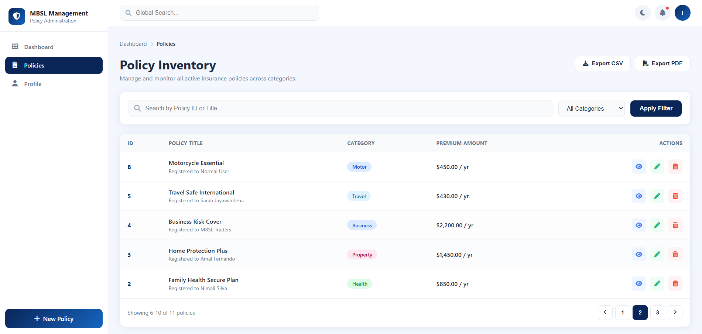
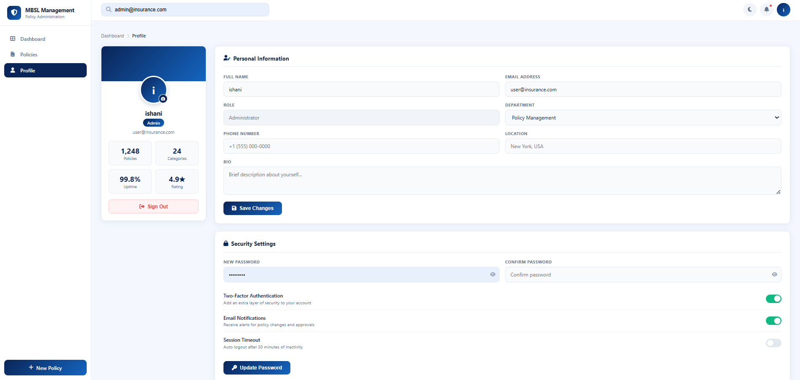
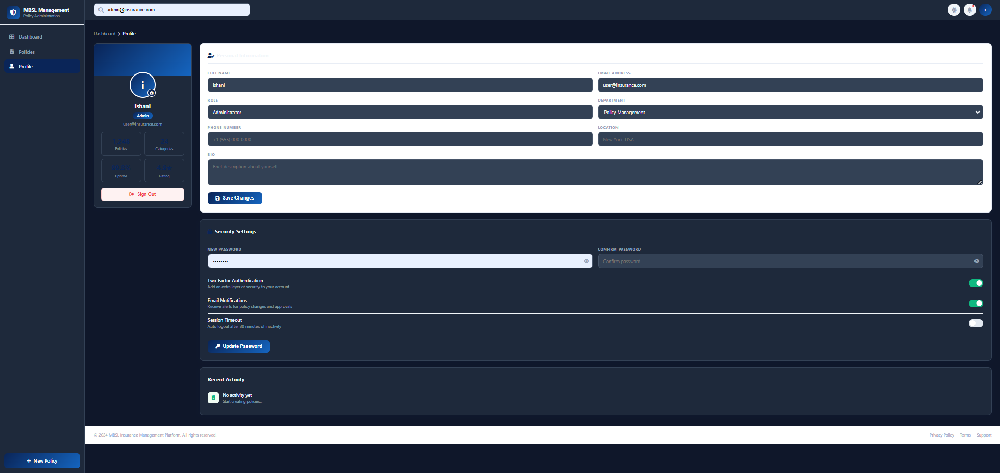
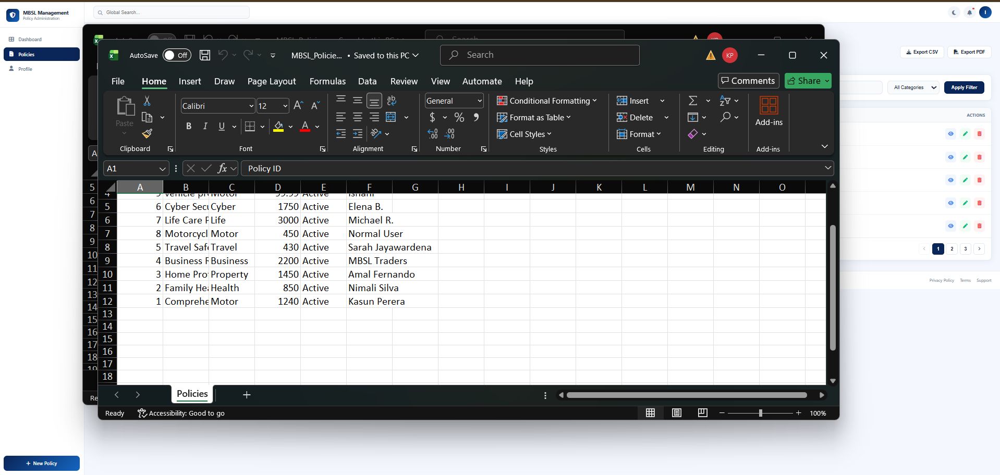
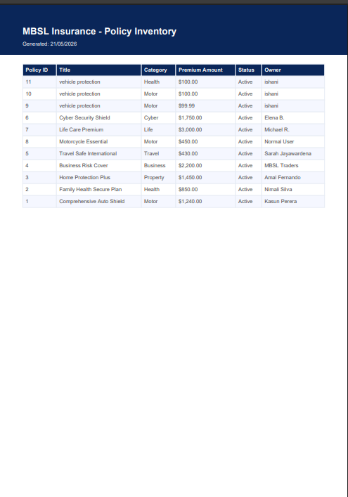
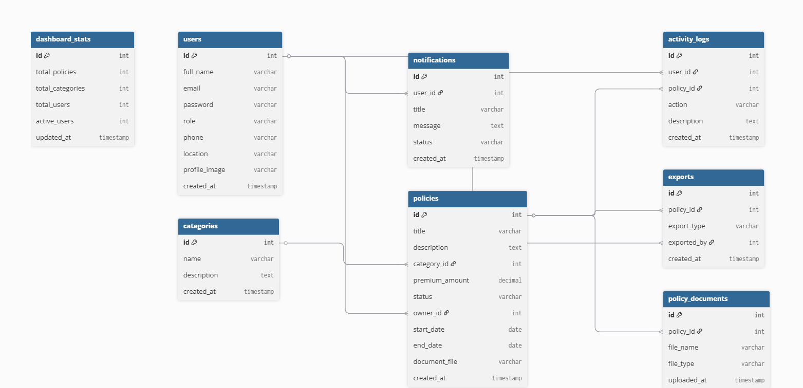

# 🛡️ MBSL Insurance Policy Management System

<div align="center">


A modern, responsive, and fully functional Insurance Policy Management System developed using **HTML, CSS, JavaScript, PHP, and MySQL**.

</div>

---

# 📌 Overview

The **MBSL Insurance Policy Management System** is a complete web-based platform designed to manage insurance policies efficiently through a clean and responsive interface.

The system provides administrators and users with powerful features including policy management, dashboard analytics, profile management, exports, reporting, activity tracking, responsive mobile support, and dark mode UI.

This project was developed as a full-stack academic and learning-based application using frontend and backend technologies with MySQL database integration.

---

# ✨ Key Features

## 🔐 Authentication System
- Secure Login System
- Admin & Normal User Roles
- Session Handling
- Protected Pages

---

## 📋 Policy Management
- Add New Policies
- Edit Existing Policies
- Delete Policies
- View Policy Details
- Search & Filter Policies

---

## 📊 Dashboard Analytics
- Total Policies Counter
- Total Categories Counter
- Active Users Statistics
- Premium Volume Analysis
- Interactive Performance Charts
- Recent Alerts & Notifications

---

## 📄 Export Features
- Export Policy Data to Excel
- Export Policy Reports to PDF

---

## 👤 User Profile Management
- Update User Information
- Security Settings
- Password Update
- Activity Tracking

---

## 🌙 UI & Responsive Design
- Fully Responsive Design
- Mobile Friendly Interface
- Dark Mode Dashboard
- Modern Clean UI
- Interactive Components

---

# 🛠️ Technologies Used

| Technology | Purpose |
|---|---|
| HTML5 | Frontend Structure |
| CSS3 | Styling & Responsive Design |
| JavaScript | Frontend Logic |
| PHP | Backend Development |
| MySQL | Database Management |
| XAMPP | Local Server Environment |
| Chart.js | Dashboard Analytics |
| Bootstrap | Responsive Components |

---

# 📂 Project Structure

```text
mbsl-system/
│
├── api/
│   ├── config/
│   ├── controllers/
│   ├── uploads/
│   └── seed.php
│
├── screenshots/
│   ├── dashboard-dark.png
│   ├── dashboard-light.png
│   ├── export-excel.png
│   ├── export.pdf.png
│   ├── policies-page.png
│   ├── profile-dark.png
│   ├── profile-page.png
│   └── er-diagram.png
│
├── add-policy.html
├── dashboard.html
├── policies.html
├── profile.html
├── index.html
├── database.sql
├── README.md
└── .gitignore
```

---

# 🔐 Login Credentials

## 👨‍💼 Admin Account

```text
Email: admin@insurance.com
Password: admin123
```

---

## 👤 Normal User Account

```text
Email: user@insurance.com
Password: admin123
```

---

# 📱 Screenshots

---

## 1️⃣ Dashboard - Dark Mode



---

## 2️⃣ Dashboard - Light Mode



---

## 3️⃣ Policies Management Page



---

## 4️⃣ User Profile Page



---

## 5️⃣ Profile Page - Dark Mode



---

## 6️⃣ Export Policies to Excel



---

## 7️⃣ Export Policies to PDF



---

## 8️⃣ Database ER Diagram



---

# ⚙️ Installation & Setup Guide

## 📌 Prerequisites

Before running the project, ensure the following software is installed:

- XAMPP
- PHP 8+
- MySQL
- VS Code (Recommended)
- Modern Web Browser

---

# 🚀 Step 1 — Clone the Repository

```bash
git clone https://github.com/ishani-perera/mbsl-system.git
```

---

# 🚀 Step 2 — Move Project to XAMPP

Move the project folder into:

```text
C:\xampp\htdocs\
```

Final project path should be:

```text
C:\xampp\htdocs\mbsl-system-fixed\mbsl-system
```

---

# 🚀 Step 3 — Start Apache & MySQL

Open **XAMPP Control Panel** and start:

- Apache
- MySQL

---

# 🚀 Step 4 — Import the Database

## Open phpMyAdmin

```text
http://localhost/phpmyadmin
```

---

## Create Database

```text
mbsl_insurance
```

---

## Import SQL File

1. Click **Import**
2. Select:

```text
database.sql
```

3. Click **Go**

---

# 🚀 Step 5 — Run the Application

Open browser:

```text
http://localhost/mbsl-system-fixed/mbsl-system/index.html
```

---

# 🔌 API Endpoints

## 🔐 Authentication APIs

| Method | Endpoint | Description |
|---|---|---|
| POST | /api/login.php | User Login |
| POST | /api/register.php | User Registration |

---

## 📋 Policy APIs

| Method | Endpoint | Description |
|---|---|---|
| GET | /api/controllers/Policy.php?action=list | Get All Policies |
| GET | /api/controllers/Policy.php?action=stats | Get Dashboard Statistics |
| POST | /api/controllers/Policy.php?action=create | Create New Policy |
| PUT | /api/controllers/Policy.php?action=update | Update Policy |
| DELETE | /api/controllers/Policy.php?action=delete | Delete Policy |

---

# 📊 Dashboard Features

- Policy Performance Analytics
- Premium Volume Tracking
- Active User Monitoring
- Category Distribution
- Real-Time Dashboard Statistics
- Recent Alerts & Notifications

---

# 📄 Export & Reporting

## Excel Export
Generate downloadable Excel reports for policy records.

## PDF Export
Generate professional PDF policy reports.

---

# 📱 Responsive Design

The system is fully optimized for:

- Desktop Devices
- Tablets
- Mobile Devices

---

# 🔒 Security Features

- Secure Authentication
- Session Management
- Input Validation
- Protected API Requests
- Data Sanitization

---

# 🧪 Testing

## Tested Modules

- Authentication System
- Policy CRUD Operations
- Search & Filtering
- Dashboard Analytics
- Export Features
- Responsive UI

---

# 🗂️ ER Diagram

The ER Diagram below represents the database structure and relationships used in the system.


---

# 🐞 Troubleshooting

## Apache Not Starting

- Close Skype / IIS
- Change Apache Port if required

---

## Database Connection Error

Ensure:
- MySQL is running
- Database credentials are correct
- SQL file is imported properly

---

## 404 Not Found Error

Ensure project folder exists inside:

```text
htdocs/
```

Correct URL:

```text
http://localhost/mbsl-system-fixed/mbsl-system/index.html
```

---

# 📈 Future Improvements

- JWT Authentication
- Email Notifications
- Cloud Deployment
- Advanced Reports
- Payment Gateway Integration
- Role-Based Access Control

---

# 👩‍💻 Developer

## Ishani Perera

🔗 GitHub: https://github.com/ishani-perera

---

# 📜 License

This project is licensed under the MIT License.

---

# ⭐ Show Your Support

If you like this project, please give it a ⭐ on GitHub.

---

# ❤️ Acknowledgements

Special thanks to everyone who supported and contributed to the development of this project.

---

<div align="center">

Made with ❤️ using PHP, MySQL, JavaScript & Bootstrap

</div>